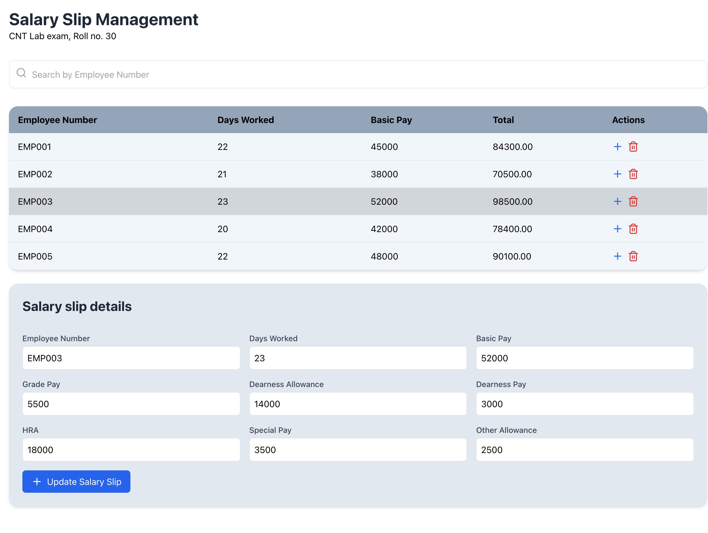

#  Problem statement

Design and develop a respoinsive website to prepare salary slip using react, node js and mongoDB.

# Project Setup and Start Guide  

## MongoDB setup 

install and start mongodb (port should be 27017)
make sure no other service is running on port 5015

## Backend Setup  
1. Navigate to the `backend` folder:  
   ```bash  
   cd backend  
   ```  
2. Install dependencies:  
   ```bash  
   npm install  
   ```  
3. Start the backend server:  
   ```bash  
   node server.js  
   ```  

## Frontend Setup  
1. Navigate to the `frontend` folder:  
   ```bash  
   cd frontend  
   ```  
2. Install dependencies:  
   ```bash  
   npm install  
   ```  
3. Start the frontend server:  
   ```bash  
   npm start  